

# sinhex

[Sergio García Seco (ser356)](mailto:sergiogarciaseco@usal.es)

## Abstract

Synesthetic relations between given images and generated audible outputs as result (INTERACCION PERSONA ORDENADOR USAL).

Use of Flutter and Dart for the development of a mobile application that allows the user to generate melodies from images.

## Keywords

_**API, AI, audience, Cupertino, Dart, Figma, flutter, hexadecimal, interface, Material Design, prototype, synesthesia, Trello, WebDesign**_

## CONCEPTOS

_**API, AI, audiencia,Cupertino, Dart, Figma,  flutter, hexadecimal, interfaz, Material Design, prototipo, sinestesia, Trello, WebDesign**_

## Introducción

sinhex se presenta como una alternativa para aquellas personas que no tienen la capacidad de realizar asociaciones sinestésicas de manera natural.

La sinestesia según el diccionario de la Real Academia de la Lengua Española consiste en la unión de sensaciones procedentes de diferentes dominios sensoriales, esto es, una melodía con color, una ecuación con sonido etc.

Una idea simple en la que el sistema obtendrá una referencia de la imagen proporcionada y realizará una interpretación exclusiva para cada una de ellas.

El resultado será una melodía única y exclusiva para cada imagen.

## Objetivos

El objetivo principal es la creación de una aplicación móvil que permita al usuario generar melodías a partir de imágenes.

## Justificación

Desde la perspectiva del creador siempre se ha querido facilitar la experiencia del usuario en lo referente a lo artístico-musical.

A lo largo del documento se refleja la constante fijación por la música por parte del autor y el deseo de compartir dicha experiencia a través de diferentes ideas.

Tras numerosos cambios en el enfoque sinhex es la idea que se lanza como propuesta final.

# Estado del Arte

## Busqueda de Necesidades

### **Metodología Needfinding**

Para sinhex se ha realizado una evaluación de la audiencia sin tener en cuenta el rango de edad puesto que se asume como una aplicación meramente recreacional, para todo el mundo.

Se proporciona un enlace al
[formulario de evaluación](https://forms.gle/dFPVda9KauMmzQEK6).

A continuación se detalla el análisis de las preguntas realizadas.

#### **¿Qué instrumento musical le relaja más?**

Se ha obtenido una clara victoria del piano con un 75% de los votos, seguido del violín con un 25%.

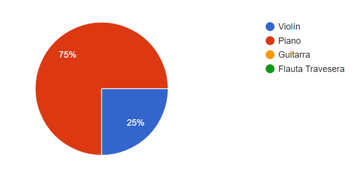

#### **¿Es usted capaz de realizar asociaciones sinestésicas?**

Sorprendentemente la mayoría de la gente entrevistada sí que es capaz de realizar asociaciones sinestésicas, lo que sugirió un cambio de enfoque en la forma de aprender de los usuarios y en la manera en la que se entendió la necesidad de crear una aplicación 'sinestésica'.

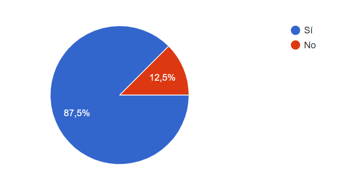

¿Por qué no centrarse en qué asociaciones sinestésicas se realizan con menor frecuencia y así poder suplir una necesidad en todo usuario?

#### **¿Le gustaría una aplicación que realizara asociaciones sinestésicas por usted?**

En una escala del 0 (poco interesado) al 5 (muy interesado) se ha obtenido una media de 3.37, lo que indica que la audiencia está interesada en la creación de una aplicación de este tipo.
Tan solo dos personas han indicado que no les interesa.
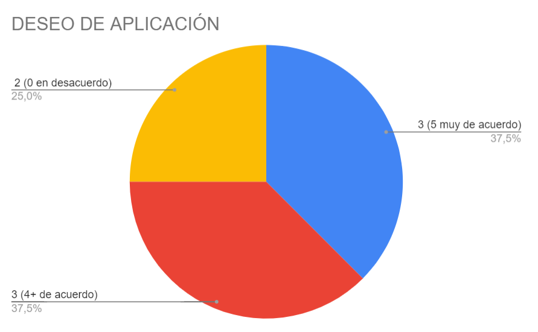

#### **Inclusión de nuevos tipos de sinestesia**

Tras realizar la pregunta al usuario de qué tipos de sinestesia eran capaces de realizar se obtuvieron resultados variopintos.

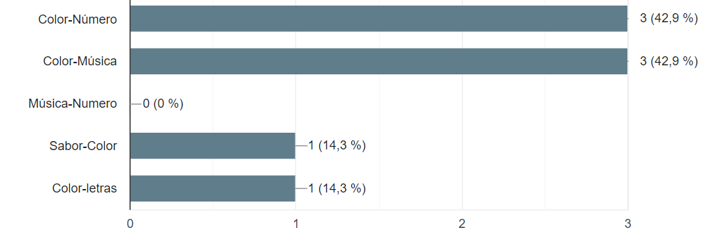

Tal y como se menciona en el apartado anterior, se ha decidido incluir nuevos tipos de sinestesia para que el usuario pueda experimentar con ellos.

La audiencia no ha sido capaz de realizar asociaciones de números con colores, y ¿qué mejor que el sistema hexadecimal para ello?

## Elección del nombre

El juego de palabras entre sinestesia y hexadecimal proporciona el nombre de la aplicación.

## Aplicaciones similares y posibles competidores

#### **Synesthesia**

Synesthesia es una aplicación web que permite crear videos speech-to-text a partir de un texto introducido por el usuario.

El usuario puede elegir entre una serie de voces y de idiomas.

El resultado es un video con una animación de fondo y un texto que se va escribiendo a medida que se va escuchando.

Realmente no es una aplicación que compite con sinhex, pero sí que realiza asociaciones sinestésicas de algún modo puesto que convierte texto en audio.

## LLuvia de ideas

Tras la evaluación de la audiencia se ha contrastado el interes del público entrevistado con las motivaciones del creador para la elaboración de la aplicación final.\
 Se ha empleado Trello como herramienta para la lluvia de ideas y para la creación de listas to-do.

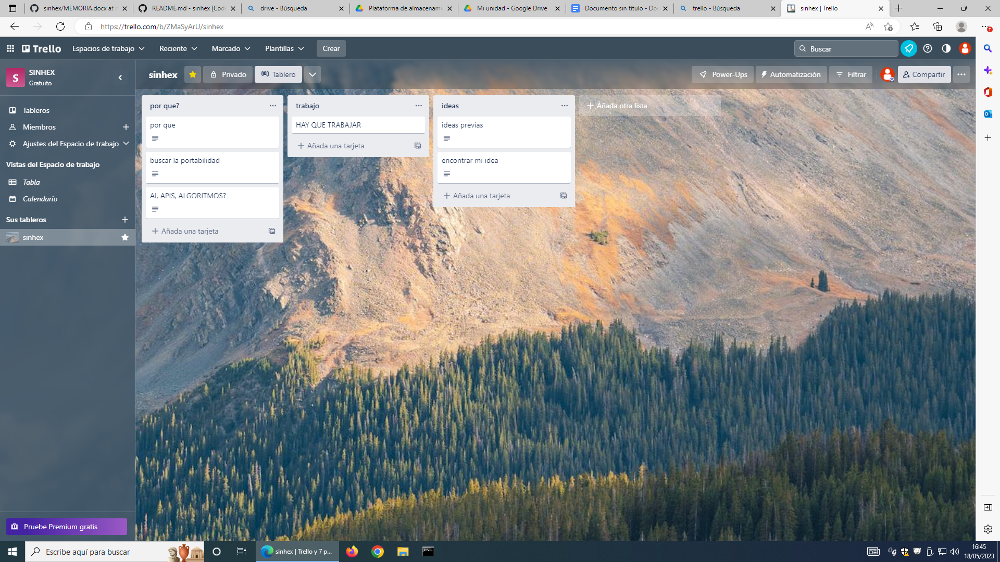

Es importante resaltar que sinhex es la elección final tras varias ideas propuestas a lo largo del curso.

Tal y como se ha puesto de manifiesto con anterioridad, dichas ideas están íntimamente relacionadas, y a pesar de prescindir de ellas, forman parte del proceso de aprendizaje necesario para elaborar lo que finalmente es sinhex.

**SETS**, listas inteligentes, se presentó como propuesta inicial en el elevator pitch.
Consistía en un manejador y creador de listas para todo el mundo basado en el estado de ánimo y la popularidad sincronizado con Spotify.

Se creó un pequeño prototipo web empleando Svelte para el frontend y NodeJS para el backend.

El creador asistió a un taller de APIs para reforzar el conocimiento sobre las mismas.

Finalmente se desechó la idea por ser poco innovadora y no tener capacidad real de competir en el mercado con el resto de rivales (existen aplicaciones que consumen la API de Spotify de forma mucho más eficiente, sistemática y que están verdaderamente asentados).

## Diseño de la Interfaz de Usuario

Detalle de la interfaz del usuario así como evaluaciones heurísticas y de usabilidad por parte de 3 usuarios anónimos antes de la implementación.

[**Consideraciones**](#consideraciones-estéticas)

[**Links de Utilidad**](#links-de-utilidad)

[**Estructura del Sistema**](#estructura-del-sistema)

- [SplashScreen](#splashscreen)

- [LoginForm](#loginform)

- [Settings](#settings)

- [RegistroForm](#registroform)

- [StartScreen](#startscreen)

- [LoadCandidate](#loadcandidate)

## Consideraciones Estéticas

Se ha empleado Figma para la creación de la interfaz de usuario.

Se utiliza la misma estética en todo el sistema, con el fin de que el usuario no se pierda en la navegación.

Los saltos y animaciones elegidos para cada pantalla también han sido los mismos.

Se ha seguido el diseño Material, empleado por Google, para la creación de la interfaz.

Se puede estructurar el Prototipo Digital en cuatro grupos, que en función de en sus subescenarios se dividen en otras pantallas que aportan la funcionalidad.

## Links de Utilidad

Acceso a Figma: [Figma SIN(#)](<https://www.figma.com/file/4lvWH1rp3yNchfrisyp8SF/sin(%23)?type=design&node-id=0%3A1&t=vYXxXjMuf6WuhWdQ-1>)

Navegación por la Interfaz: [sin# TUTORIAL](https://youtu.be/ofFsVAbTR2o)

Acceso a Trello: [Trello](https://trello.com/b/ZMaSyArU/sinhex)

## Estructura del Sistema

El diagrama de flujo de las acciones que el usuario puede realizar de manera global se ha prototipado de la siguiente manera.

Mas adelante se elaboran escenarios de uso ficticios en los que se realizan ciertos flujos de acciones.

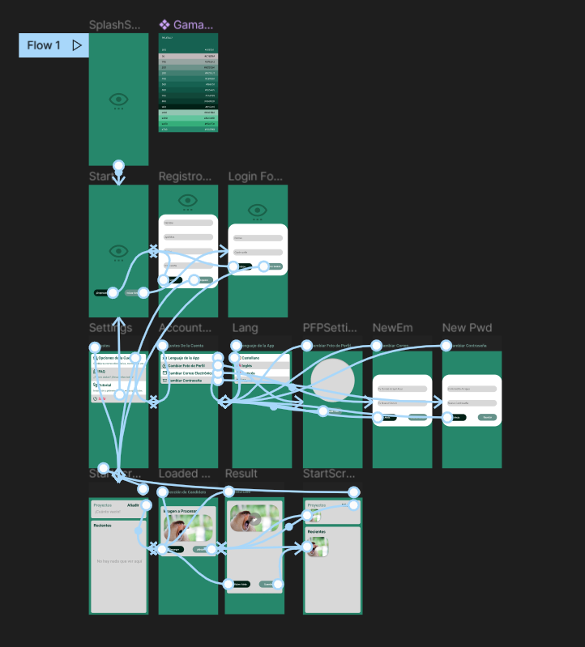

## SplashScreen

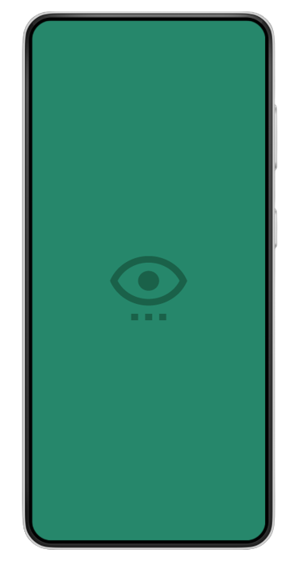

Pantalla que aparece al iniciar la App. 
En la implementación servirá para realizar
las cargas antes del inicio

## LoginForm

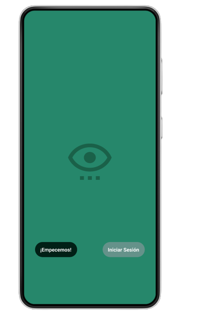

Inicio de Sesión 
Pantallas accesibles: <a href="#registroform">RegistroForm</a>, <a href="#startscreen">StartScreen</a> 

## Settings

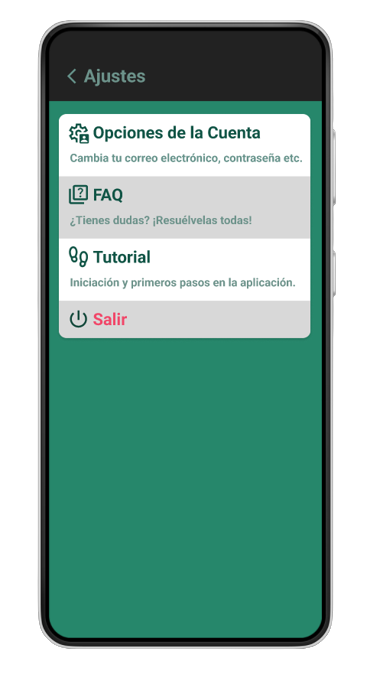

ListView con acceso a múltiples funciones de
configuración. Pantallas accesibles: <a href='#accountsettings'>AccountSettings</a>, <a href="#faq">FAQ</a>, <a href="#tutorial">Tutorial</a>,
<a href="#salir">Salir</a>.
 

## _Desglose de los Ajustes:_

### **AccountSettings**

1. #### **Lenguaje de la App**

   Es posible modificar el lenguaje predeterminado de la aplicación.

   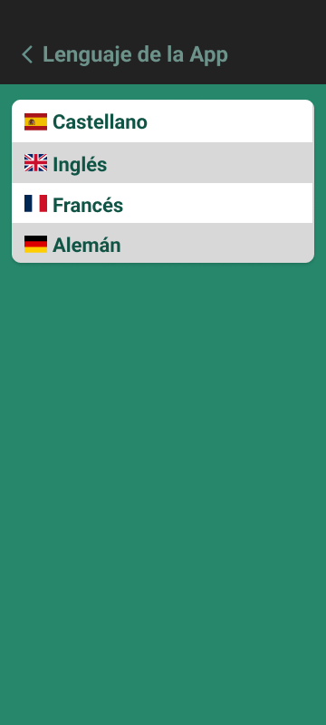

2. #### **Cambiar Foto de Perfil**

   Se ha implementado un selector de imágenes para la aplicación.

   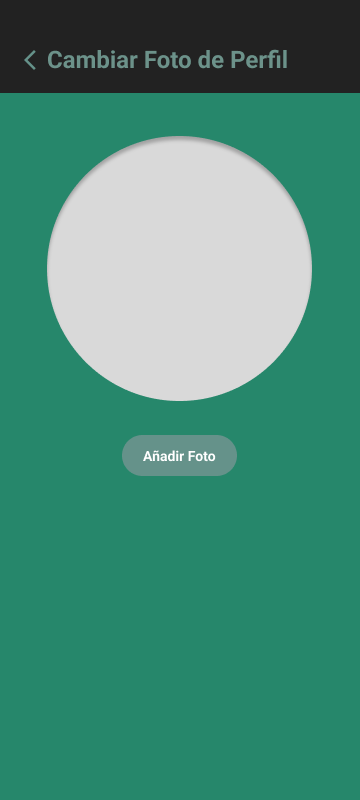

3. #### **Cambiar Correo Electrónico**

   Permite modificar el correo electrónico asociado a la cuenta.

   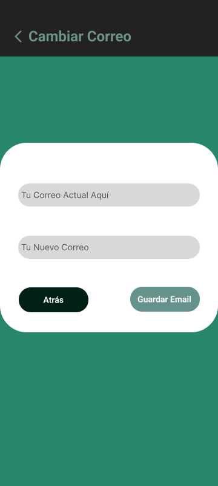

4. #### **Cambiar Contraseña**

   Permite modificar la contraseña asociada a la cuenta.

   

### **FAQ**

No es una pantalla perse, sino un enlace a GitHub con la documentación de la aplicación.

### **Tutorial**

No es una pantalla perse, sino un enlace a YouTube con un ejemplo de uso de la aplicación.

### **Salir**

Proporciona un Logout de la aplicación. Se vuelve a la pantalla de inicio de sesión.

## RegistroForm

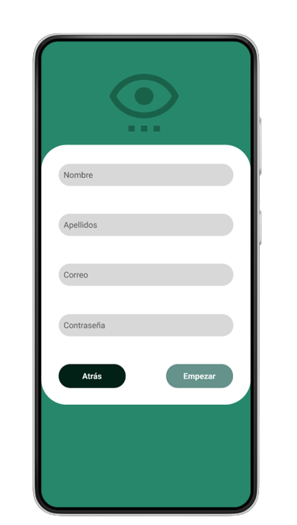

Registro en el Sistema 
Pantallas accesibles: <a href="#loginform">LoginForm</a> 

## StartScreen

 

Pantalla Inicial, con conexión directa al resto de funcionalidades. 
Pantallas accesibles: <a href="#loadcandidate">LoadCandidate</a>, <a href="#settings">Settings</a> 

## LoadCandidate

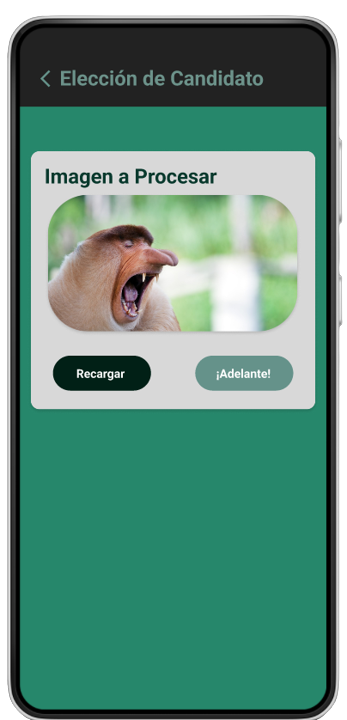

La parte de lógica de negocio de la aplicación
subyace en este apartado. Se carga el candidato
y se realiza la asociación. 
Pantallas accesibles: <a href="#startscreen">StartScreen</a> 

## **Escenarios de uso**

Se definen los siguientes escenarios de uso teniendo en cuenta las conexiones entre pantallas.

Una vez se ha realizado el registro en el sistema, el usuario puede acceder a la aplicación.

El acceso queda reservado a usuarios registrados.

### **Escenario 1**

Cambio de contraseña.

 

### **Escenario 2**

Cambio de correo electrónico.

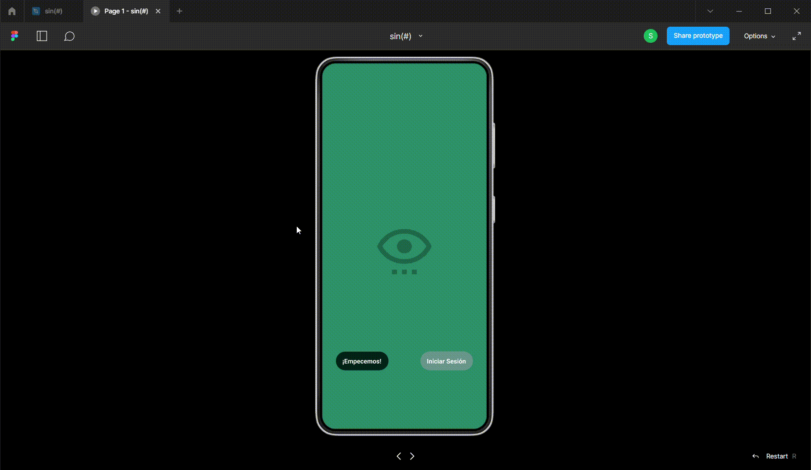 

### **Escenario 3**

Cambio de idioma.

 

### **Escenario 4**

Cambio de foto de perfil.

### **Escenario 5**

Salir de la aplicación.

### **Escenario 6**

Carga de candidato.

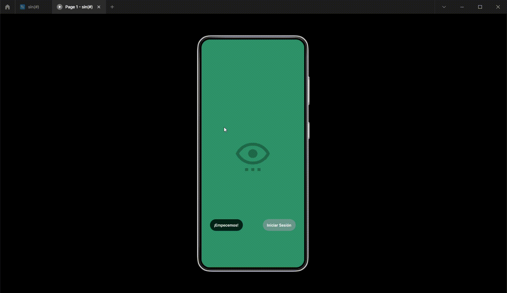

### _NOTA_ : La versión final del prototipo modifica ciertas características en las ventanas de cambio de contraseña y email con respecto a entregas anteriores puesto que ciertas opciones de navegación contenian errores (en esta versión corregida se navega respectivamente al inicio de sesión y a la misma pantalla).

## **Error Handling**

Las pantallas con alta capacidad de contener error por parte del usuario incorporan botones de cancelación y de confirmación.

Si el usuario no desea realizar la acción, puede cancelarla y volver a la pantalla anterior.

Además se cuenta tanto con la documentación de la aplicación como con un tutorial de uso.

Los botones clicables de desplazamiento hacia atrás están disponibles están disponibles en tres formas distintas:

- _**Botón de desplazamiento hacia atrás en la barra de navegación.**_

   
   
   Disponible en todas las pantallas con SnackBar menos la inicial, permite volver a la pantalla anterior.

- _**Botón Stadium en la parte inferior de la pantalla 'Atrás'.**_

   

  Disponible en los formularios, permite volver a la pantalla anterior.

- _**Botón Stadium en la parte inferior de la pantalla (variación) 'Volver Atrás'.**_

   

   Disponible en la pantalla de resultado de la asociación, permite volver a la pantalla anterior.

- _**Botón Stadium en la parte inferior de la pantalla 'Recargar'.**_

   

  Disponible en la elección del candidato, devuelve el control al sistema operativo para que el usuario pueda elegir otra imagen.

## **Evaluación Heurística**

Se ha realizado una evaluación heurística de la interfaz de usuario por parte de 3 usuarios anónimos.

La evaluación heurística es una técnica de inspección de usabilidad que se utiliza para identificar problemas de usabilidad en la interfaz de usuario de los diseños. Se basa en una lista de principios de usabilidad (heurísticas) que se aplican a la interfaz de usuario para detectar problemas de usabilidad.

Fue acuñada por Jakob Nielsen en 1989-1990.

De acuerdo con los criterios de Nielsen, la evaluación heurística ha seguido el siguiente decálogo:

1. Visibilidad del estado del sistema:
   > El sistema debe mantener informado al usuario sobre lo que está sucediendo, a través de retroalimentación apropiada dentro de un tiempo razonable.
2. Coincidencia entre el sistema y el mundo real:
   > El sistema debe hablar el lenguaje del usuario, con palabras, frases y conceptos familiares para el usuario, en lugar de términos orientados al sistema. Sigue las convenciones del mundo real, haciendo que la información aparezca en un orden natural y lógico.
3. Control y libertad del usuario :
   > Los usuarios a menudo eligen funciones del sistema por error y necesitan una "salida de emergencia" claramente marcada para salir del estado no deseado sin tener que pasar por un diálogo extenso. Admite "deshacer" y "rehacer" (o en su defecto cancelar).
4. Consistencia y estándares:
   > Se siguen las convenciones de la plataforma.
5. Prevención de errores:
   > Inclusión de mensajes de error y confirmación de acciones.
6. Reconocimiento en lugar de recuerdo:
   > Minimizar la carga de memoria del usuario, haciendo que los objetos, acciones y opciones sean visibles. El usuario no debe tener que recordar información de una parte del diálogo a otra. Las instrucciones de uso del sistema deben ser visibles o fácilmente recuperables cuando sea apropiado.
7. Flexibilidad y eficiencia de uso:
   > Hotkeys, atajos, accesos directos, etc.
8. Estética y diseño minimalista:
   > Los diálogos no deben contener información irrelevante o rara vez necesaria. Cada unidad extra de información en un diálogo compite con las unidades relevantes de información y disminuye su visibilidad relativa. Se siguenn principios de diseño establecidos.
9. Ayuda a los usuarios a reconocer, diagnosticar y recuperarse de los errores:
   > Los mensajes de error deben ser expresados en lenguaje claro (sin códigos), indicar con precisión el problema y sugerir una solución constructiva.
10. Ayuda y documentación:
    > Incluye documentación de ayuda y tutoriales.

### **Evaluación Heurística 1**

### _Usuario 1_: David

> El flujo de uso será por tanto : Se accede al  sistema y se añade una imagen y se obtiene como resultado la imagen de vuelta más un sonido.\
El método de evaluación que voy a usar es el de Nielsen, este  método consta de 10 reglas  las cuales tienen como objetivo detectar errores que no se detectan con pruebas de usuarios.

_**1. Visibilidad del estado del sistema**_

>Consiste en darle al usuario información sobre las acciones que ha realizado, o de los fallos que está cometiendo.\
Es decir la capacidad de emitir feedback al usuario.
Después de usar durante un largo periodo de tiempo la app detecté diferente cuestiones:

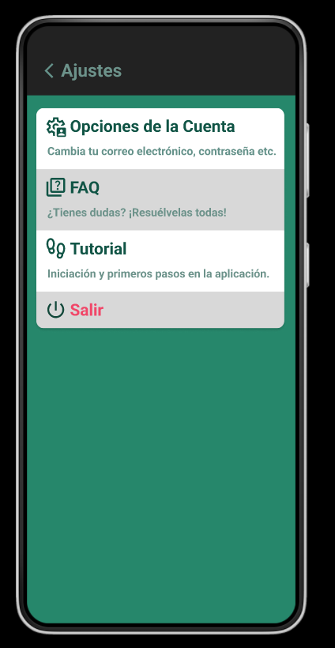
" />

>En todo momento se conoce en qué apartado te encuentras por ejemplo cuando vas al menú de ajustes, aparece un texto en la parte superior que nos indica que efectivamente estamos en el apartado de ajustes\
El único aspecto negativo a comentar es que cuando añades al candidato no recibes ningún mensaje que te indique que se ha guardado con éxito sino que simplemente vuelves a la pantalla anterior.

_**2. Coincidencia entre el sistema y el mundo real**_

>En este apartado evalúo si el sistema es comprensible desde el punto de vista de un usuario que lo usa por primera vez, sin tener automatismos adquiridos ni conocer en profundidad la app\
La app ofrece mensajes claros y sin conceptos complicados , además son aspectos tangibles y fáciles de entender.\
Como aspecto negativo recalcar que la palabra recargar no se termina de entender para qué sirve y habría que explicar algo más ese aspecto.

_**3. Control y libertad del usuario**_

>Está regla habla sobrero ofrecerle al usuario la posibilidad de hacer lo que desee, y darle la capacidad de rehacer las opciones que haya realizado por error.
La app ofrece un botón de “paso atrás”, para solucionar posibles configuraciones erróneas.

_**4. Consistencia y estándares**_

>Este aspecto califica si la app usa elementos fácilmente reconocibles por la mayoría de los usuarios, es decir que sepas que un botón va a realizar la acción que sea por que ya los ha visto en otras apps.\
En este aspecto la app tiene un botón con un + que sirve par añadir, es un recurso muy bueno y que da entender la operación de adicción que posteriormente se va a ofrecer\ 
Otro ejemplo de buenos estándares vuelve a ser la pantalla de ajustes, los iconos empleados para todos sus elementos son muy usados en otras aplicaciones y webs por lo tanto un usuario que no tenga experiencia en la app no tendrá problema en reconocer estos iconos.

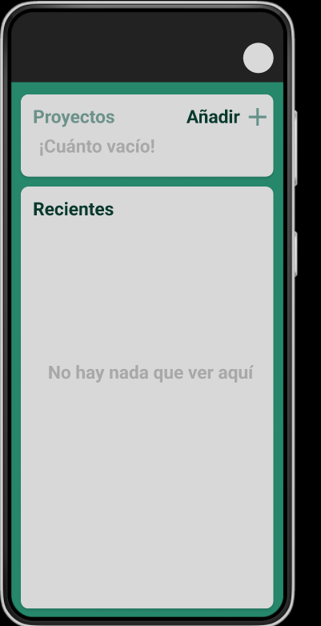
" />

_**5. Prevención de errores**_

>Hay acciones que realiza el usuario que le pueden llevar a problemas en un futuro, estas situaciones tienen que ser controladas por el sistema para que no dé lugar a errores.\
La app es consistente ante estos posibles errores, aunque no se me ocurren muchos errores posibles.\
En un posible modelo funcional tendría que asegurar la carga de los elementos correctamnete , es decir que la imagen esté en el formato correcto por ejemplo.

_**6. Reconocimiento en lugar de recuerdo**_

Lorem ipsum dolor sit amet, consectetur adipiscing elit. Nulla

_**7. Flexibilidad y eficiencia de uso**_

Lorem ipsum dolor sit amet, consectetur adipiscing elit. Nulla

_**8. Estética y diseño minimalista**_

Lorem ipsum dolor sit amet, consectetur adipiscing elit. Nulla

_**9. Ayuda a los usuarios a reconocer, diagnosticar y recuperarse de los errores**_

Lorem ipsum dolor sit amet, consectetur adipiscing elit. Nulla

_**10. Ayuda y documentación**_

Lorem ipsum dolor sit amet, consectetur adipiscing elit. Nulla

### **Evaluación Heurística 2**

### _Usuario 2_

_**1. Visibilidad del estado del sistema**_

Lorem ipsum dolor sit amet, consectetur adipiscing elit. Nulla

_**2. Coincidencia entre el sistema y el mundo real**_

Lorem ipsum dolor sit amet, consectetur adipiscing elit. Nulla

_**3. Control y libertad del usuario**_

Lorem ipsum dolor sit amet, consectetur adipiscing elit. Nulla

_**4. Consistencia y estándares**_

Lorem ipsum dolor sit amet, consectetur adipiscing elit. Nulla

_**5. Prevención de errores**_

Lorem ipsum dolor sit amet, consectetur adipiscing elit. Nulla

_**6. Reconocimiento en lugar de recuerdo**_

Lorem ipsum dolor sit amet, consectetur adipiscing elit. Nulla

_**7. Flexibilidad y eficiencia de uso**_

Lorem ipsum dolor sit amet, consectetur adipiscing elit. Nulla

_**8. Estética y diseño minimalista**_

Lorem ipsum dolor sit amet, consectetur adipiscing elit. Nulla

_**9. Ayuda a los usuarios a reconocer, diagnosticar y recuperarse de los errores**_

Lorem ipsum dolor sit amet, consectetur adipiscing elit. Nulla

_**10. Ayuda y documentación**_

Lorem ipsum dolor sit amet, consectetur adipiscing elit. Nulla

### **Evaluación Heurística 3**

### _Usuario 3_

_**1. Visibilidad del estado del sistema**_

Lorem ipsum dolor sit amet, consectetur adipiscing elit. Nulla

_**2. Coincidencia entre el sistema y el mundo real**_

Lorem ipsum dolor sit amet, consectetur adipiscing elit. Nulla

_**3. Control y libertad del usuario**_

Lorem ipsum dolor sit amet, consectetur adipiscing elit. Nulla

_**4. Consistencia y estándares**_

Lorem ipsum dolor sit amet, consectetur adipiscing elit. Nulla

_**5. Prevención de errores**_

Lorem ipsum dolor sit amet, consectetur adipiscing elit. Nulla

_**6. Reconocimiento en lugar de recuerdo**_

Lorem ipsum dolor sit amet, consectetur adipiscing elit. Nulla

_**7. Flexibilidad y eficiencia de uso**_

Lorem ipsum dolor sit amet, consectetur adipiscing elit. Nulla

_**8. Estética y diseño minimalista**_

Lorem ipsum dolor sit amet, consectetur adipiscing elit. Nulla

_**9. Ayuda a los usuarios a reconocer, diagnosticar y recuperarse de los errores**_

Lorem ipsum dolor sit amet, consectetur adipiscing elit. Nulla

_**10. Ayuda y documentación**_

Lorem ipsum dolor sit amet, consectetur adipiscing elit. Nulla
